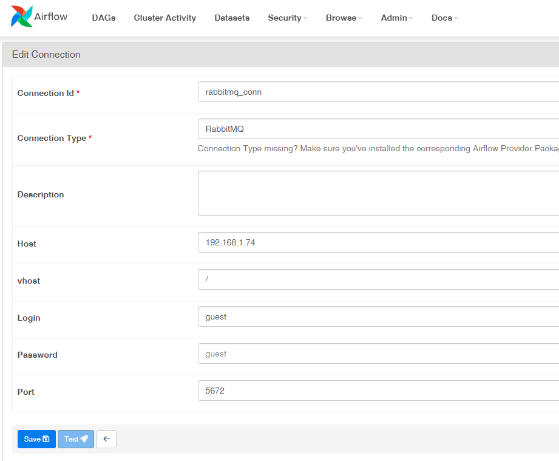
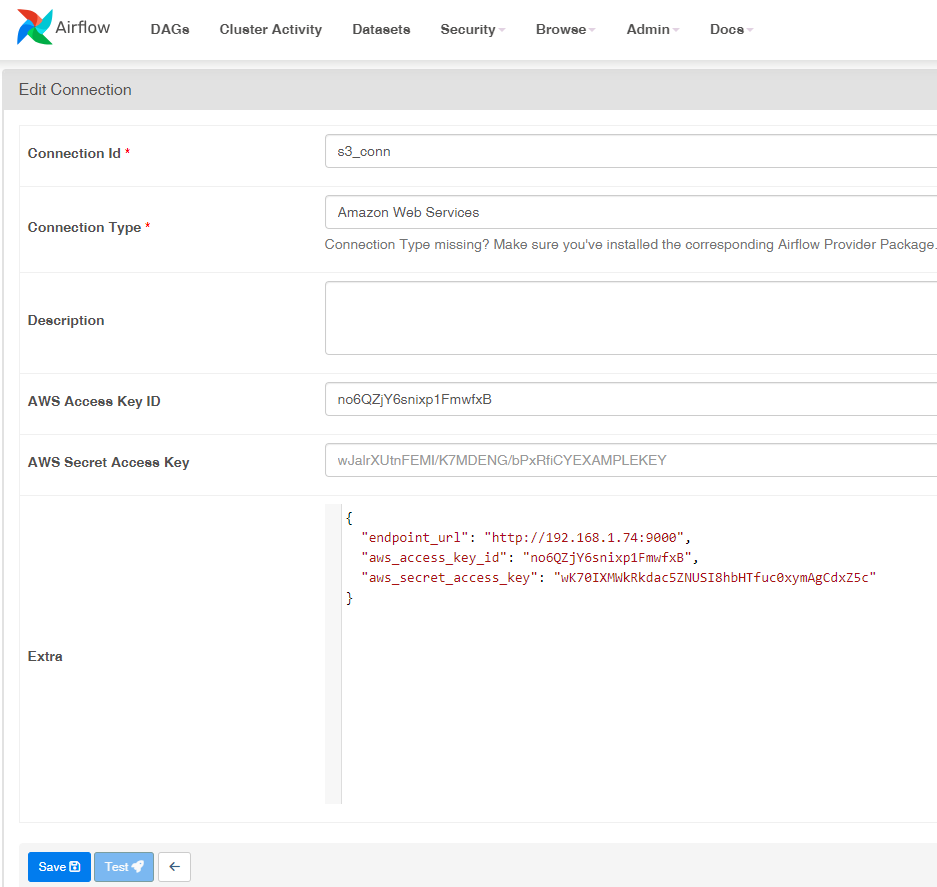
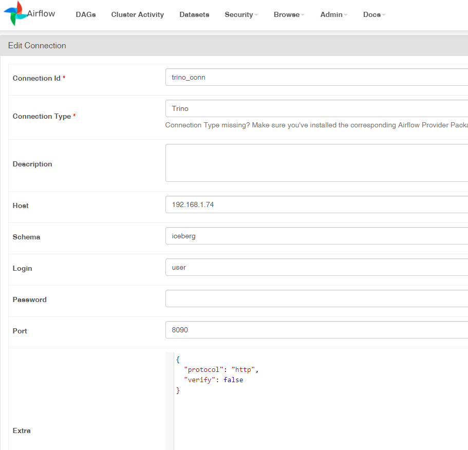
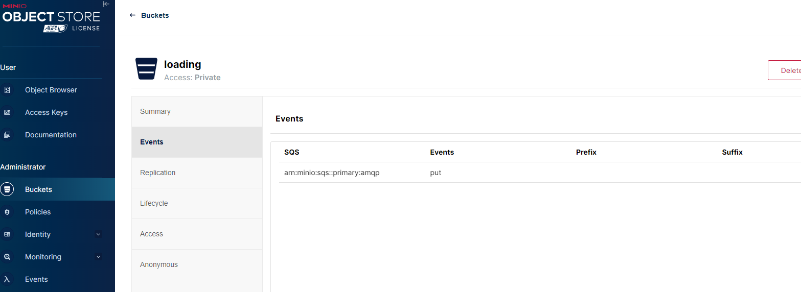

# DARE-Airflow

Convert CSV to TRINO, using Airflow DAGS, messaged by rabbitmq from minio

## Airflow Configuration
Airflow needs 3 connections (s3/rabbitmq/trino)

### Rabbit MQ Connection

### S3 Connection

### Trino Connection

**There is a issue with the code that the EXTRA part of the trino connection is currently hard coded and needs to be chanegd to use the setting in the connection**

### Trino Configuration
The docker-compose sets up trino and connects to the minio.  There is currently no additional configuration needed to stand up the dev enviroment.

The Code (DAG) will automatically create the required schemas etc

**The current configuration is not correctly wired up to use the "default" schema** Not required but somethign to tidy up

### Mino Configuration

The system currently needs TWO buckets
- loading
- working

The docker-compose currently creates these buckets **no security is aplied at this point (dev enviroment)**

Access Keys also need creating and given to airflow so the running DAG can access Minio **manual task**

The docker-compose wires up the *MINIO_NOTIFY_AMQP_...* setting to create a link from minio to rabbitmq.  However a **manual** task is to tell minio to send an event upload a file/object being uploaded.  This is done by adding the subscription tot he bucket (events tab), selecting the PUT operation.

This will create a json message uplaod upload which will get sent tot he **minio** exchaneg on rabbit.  This exchange is created by docker-compose, however if not present then minio will create it.

The docker-compose creates a queue called **airflow** which binds to this exchange, with airflow obviously ingesting the messages fromt hsi queue
